This is my packed suitcase, ready for the flight:

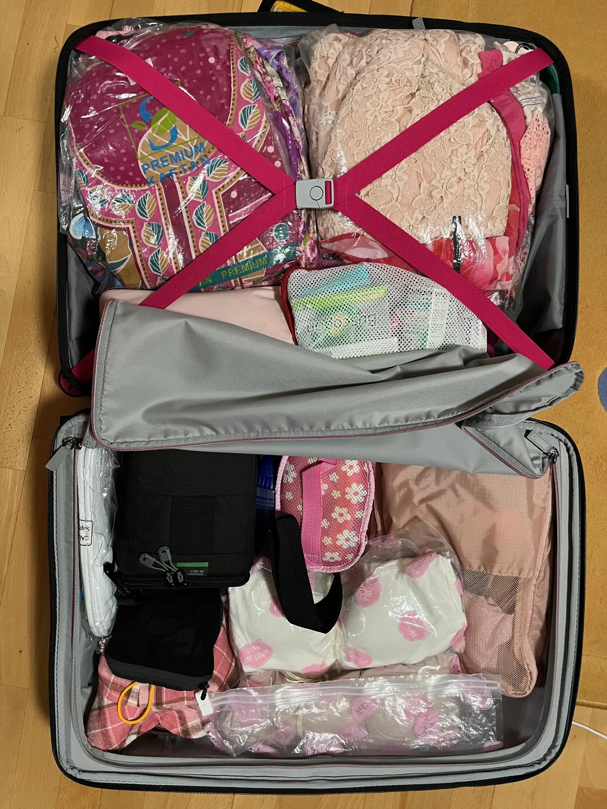

## Checkin

Margaret and I took at taxi at 6:30am and arrived at Sydney Airport International Terminal. Fortunately, at this hour of the day, with nearly 3 hours before our flight, the queue at the checkin counter was quite short, plus we had already checked in online the day before so we just needed to drop our bags. The girl behind the counter was Indonesian and she was very helpful and checked our luggage all the way to Chieng Mai. She also assisted us with boarding the lane.

## AMEX Lounge

After checkin, we headed to the AMEX Lounge. Unfortunately this was located on the opposite end of the airport relative to our boarding gate, so it's a bit of a walk to the lounge. Luckily Margaret had two spare lounge passes with her AMEX Card so we were able to enjoy the facilities of the lounge. I had my usual breakfast of bacon, scrambled eggs, sausages, baked beans, potatoes and toast plus a cup of coffee.

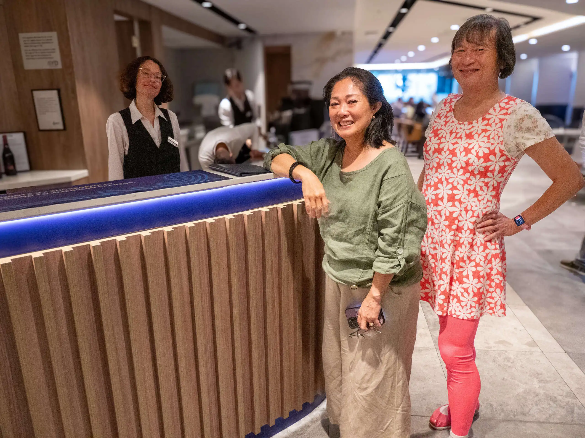

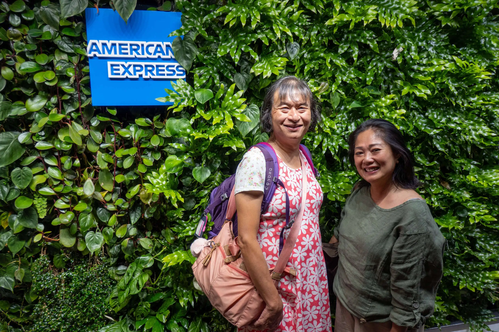

When it was to boarding we headed towards the gate. Along the way, I saw a Gentle Monster shop at the airport. I saw a similar shop at TRX in Kuala Lumpur recently so I knew they were famous for their gigantic sculptures. I posed in front a giant rotating face and Margaret took a photo just when the face was looking at me.

## Boarding flight to Bangkok

We all met together as a group at the boarding gate for Thai Airways flight TG 476 to Bangkok. We were lucky in that some of us were in Group 2 boarding, which is the first group to board after the premium passengers, so we entered the plane early and had plenty of cabin luggage space to put our bags.

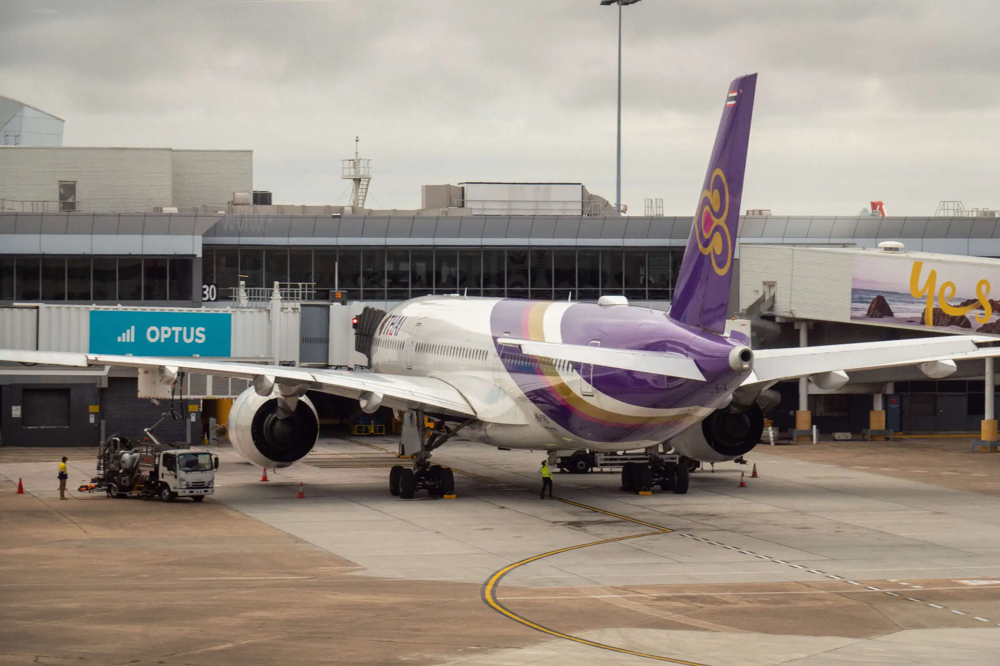

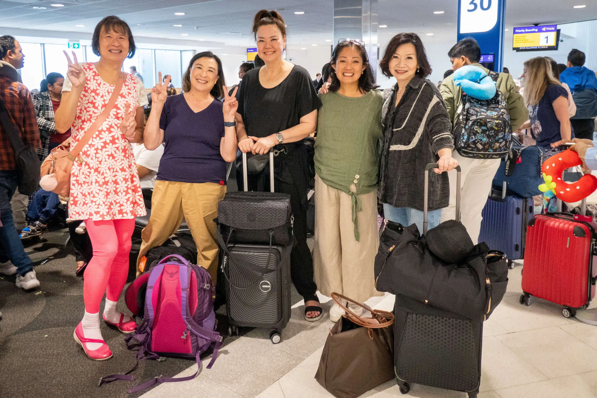

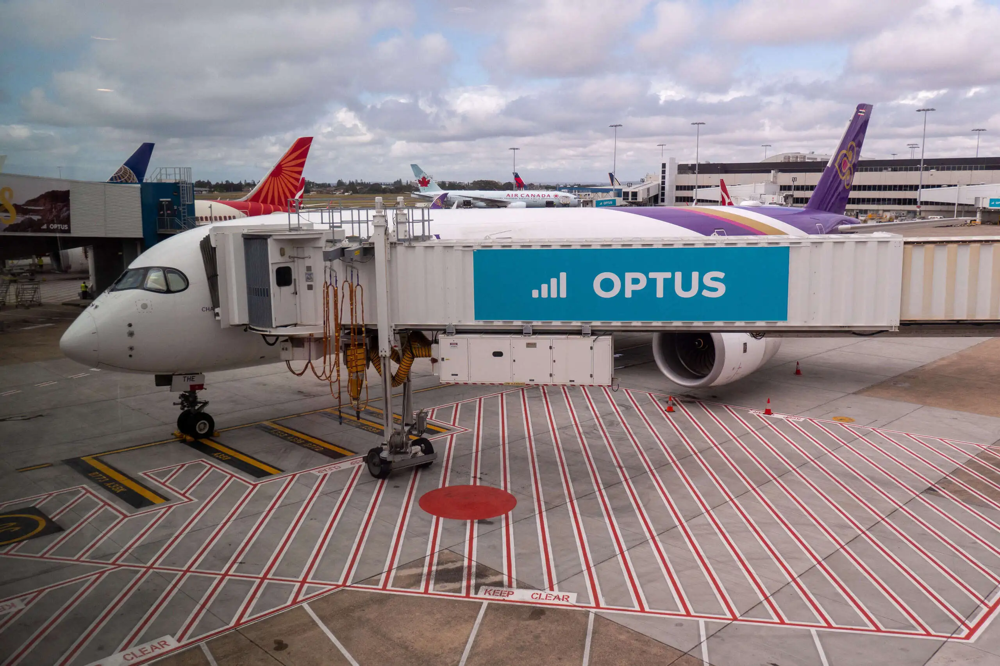

The flight was uneventful and quite pleasant. I was pleasantly surprised that I received all my meals first as I had preordered the "oriental vegetarian" option for my meals. I watched two movies:

- [Lovesick Ellie](https://www.dailymotion.com/video/x95s79u): Eriko Ichimura (Nanoka Hara) has an ordinary and unnoticed student life at her high school. Her only joy is to watch popular male student Akira Omi (Nanoka Hara) and imagine them being a couple. She writes down those thoughts on her social media account under the name of Lovesick Ellie. Akira Omi seems like a perfect guy, with good looks and gentle personality. One day, she witnesses Akira Omi spouting vulgar language and she realizes he is kind of like a two-faced person. Making things worse, her fantasy thoughts are discovered by him. He thinks that she is funny and he approaches her. [(AsianWiki)](https://asianwiki.com/Lovesick_Ellie)
- [Indiana Jones and the Dial of Destiny](https://www.imdb.com/title/tt28194558/): The legendary hero, Indiana Jones, returns in the fifth installment of this beloved swashbuckling series of films. Finding himself in a new era, approaching retirement, Indy wrestles with fitting into a world that seems to have outgrown him. But as the tentacles of an all-too-familiar evil return in the form of an old rival, Indy must don his hat and pick up his whip once more to make sure an ancient and powerful artifact doesn't fall into the wrong hands.

## Bangkok stopover

We arrived in Suvarnabhumi Airport, Bangkok, in the afternoon and cleared customs. Since we had around three hours before the next flight to Chieng Mai, we wandered around the transit area and decided to have an early dinner at [Thai Street Food by KIN](https://bester-eats.com/en/restaurant/111499/) - อำเภอบางพลี (สมุทรปราการ). I had the tom yum noodle for 231 baht (around A$11) - it was delicious and surprisingly quite filling. The others had Thai chicken rice and BBQ Portk and wantan dry noodles.

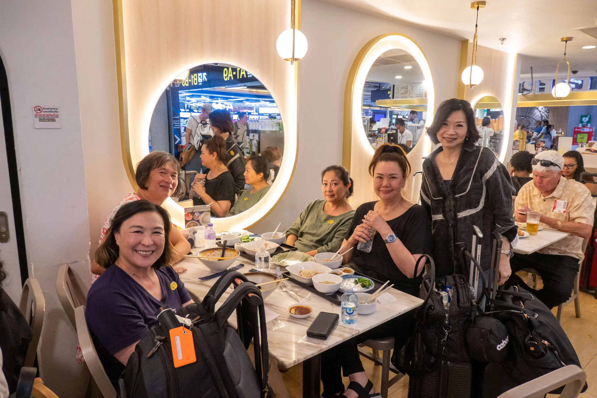

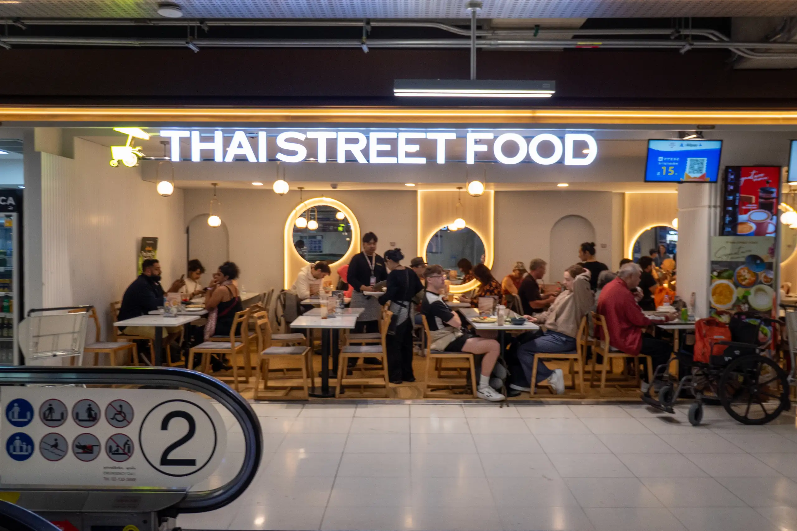

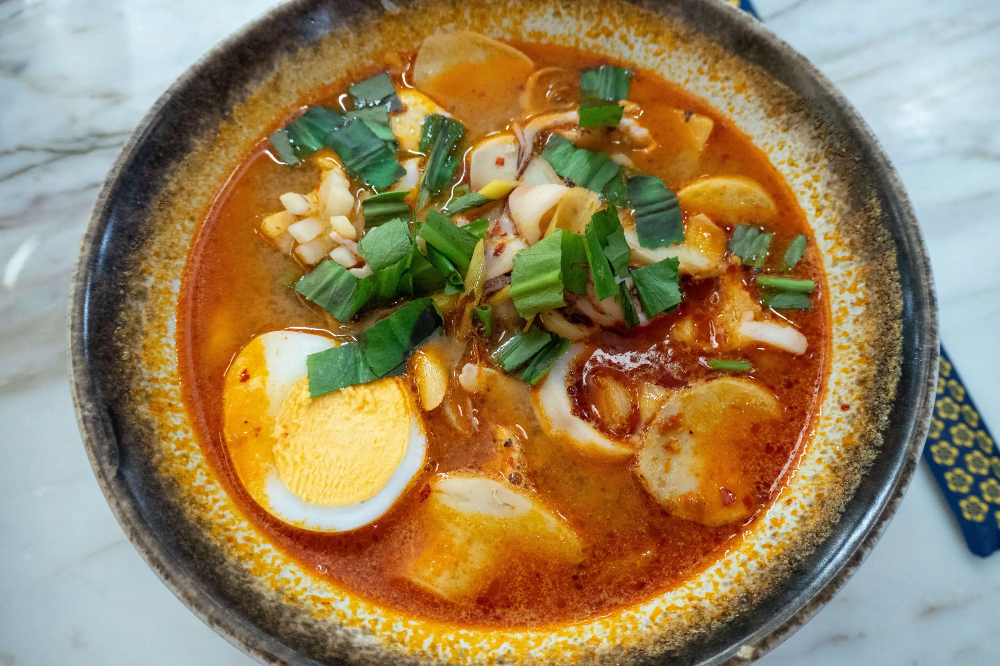

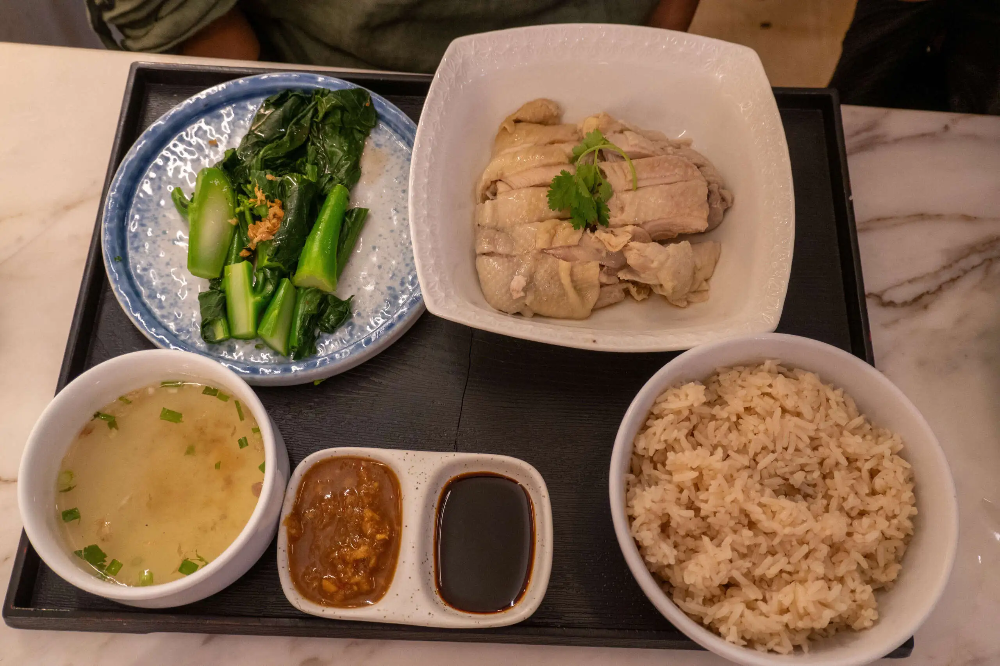

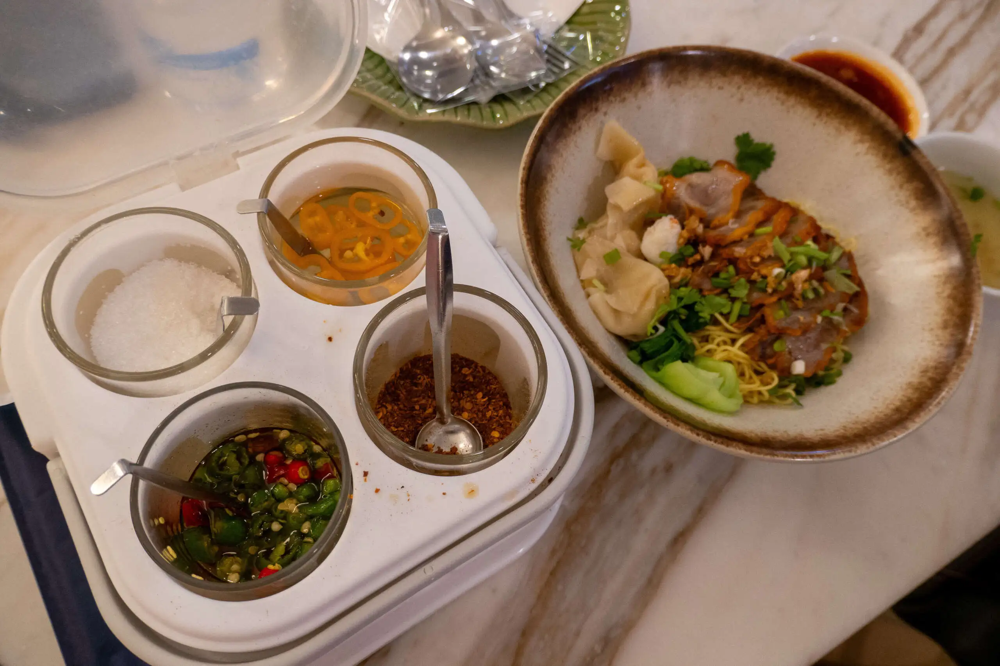

## Flight to Chieng Mai

We boarded TG 120 which departed just after 7pm and arrived about one hour later to Chieng Mai. We had no problems disembarking and claiming our baggage. The airport had quite a few lanterns and sculptures celebrating the upcoming festival.

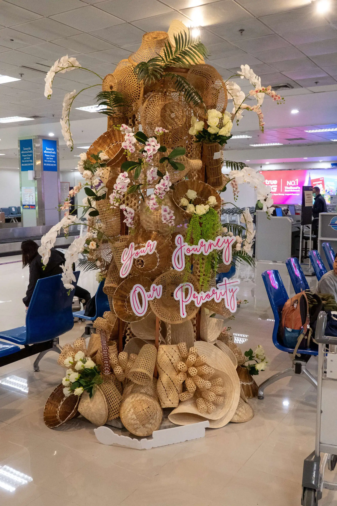

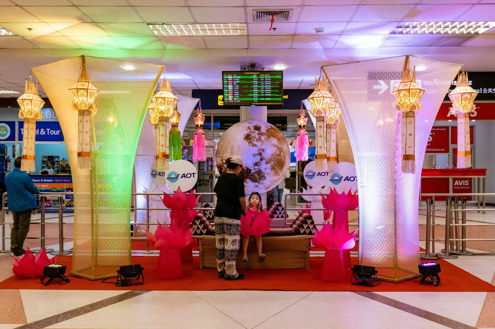

We arrived at the AirBNB accommodation. I must admit, I was really tired (it is well over midnight Sydney time) and I quickly unpacked, showered and crashed out so no pictures.
