Cat and I both woke up early, around 5AM local time (since that corresponded to 9AM Sydney time), so we decided to explore the neighbourhood.

We sneaked out of the house around 7AM and walked out of the quite residential street of Soi Muban Lanna Villa onto the main road (Interestingly named the Super Highway!). Across the Super Highway is [MAYA Lifestyle Shopping Center Chiangmai เมญ่า ไลฟ์สไตล์ ช้อปปิ้ง เซ็นเตอร์ เชียงใหม่](https://mayashoppingcenter.com). This is a big mall with cinemas, concept stores, supermarket, and many dining options, but it was not yet open:

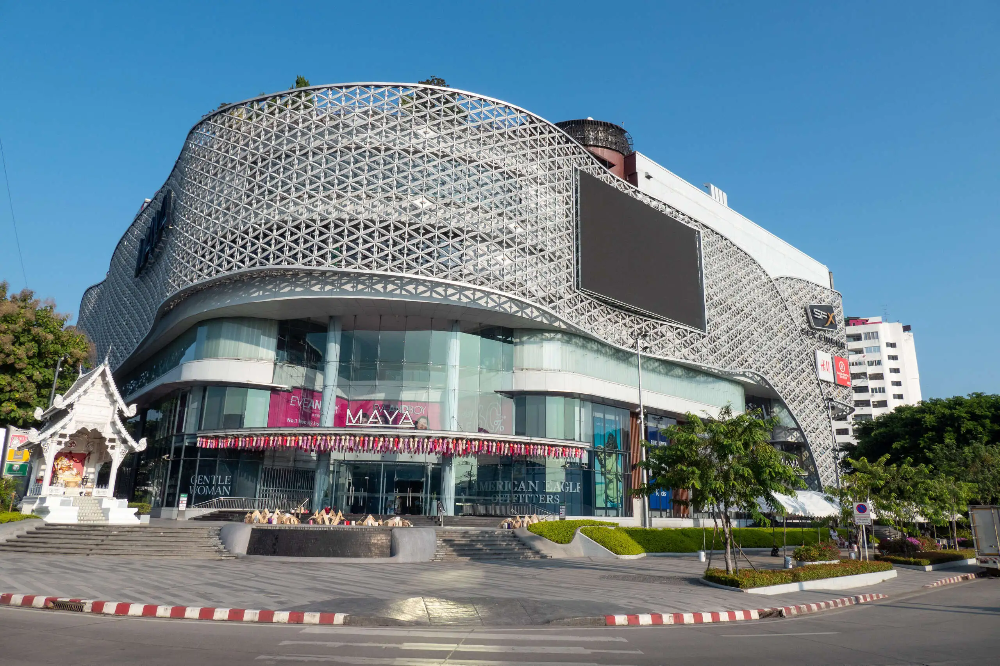

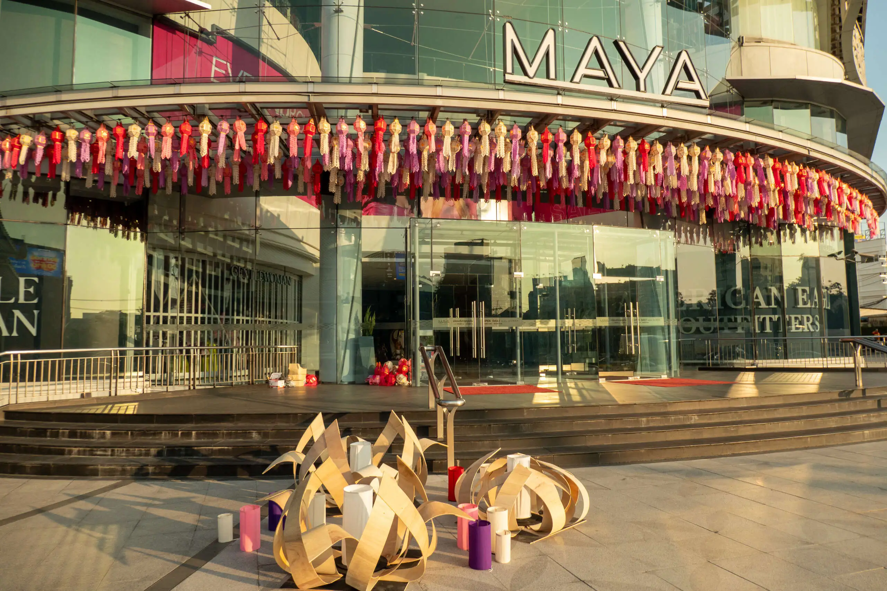

Next to the mall is an interesting elephant shrine. In Thailand, the elephant is considered a sacred animal and is closely associated with Buddhism, the predominant religion in the country. The white elephant, in particular, is seen as a symbol of purity and spiritual power. It is believed to be a harbinger of good fortune and prosperity. The image of the elephant can be found in many temples and shrines across Thailand, where they are worshipped and offered food and water as a sign of respect.

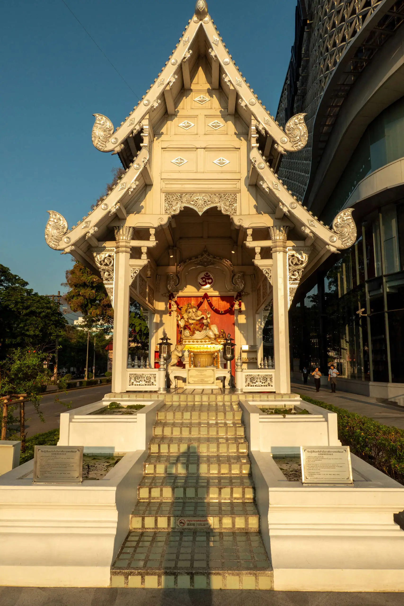

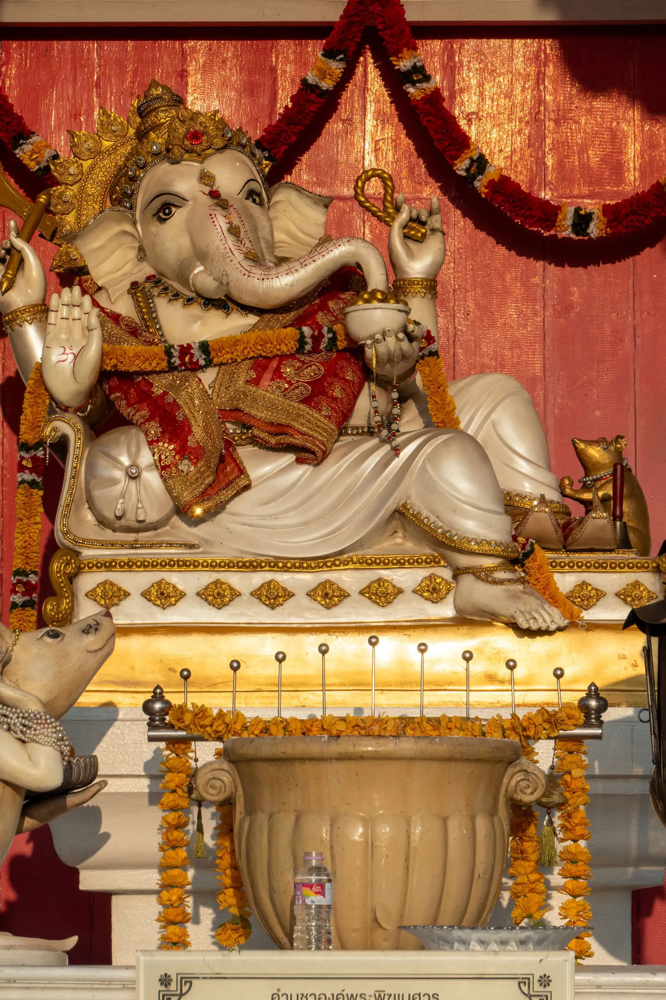

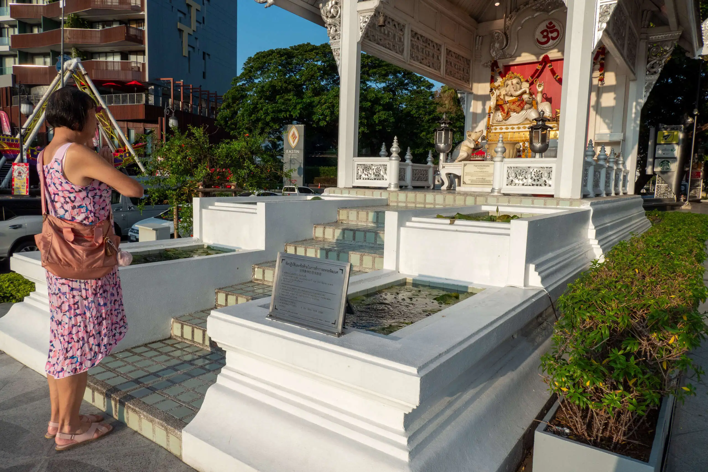

Also nearby is a shrine full of roosters. The rooster holds a significant place in Thai culture, representing courage, strength, and vigilance. In Buddhism, the rooster symbolizes the dawn, heralding the arrival of a new day and the dispelling of darkness. It is believed making offerings to roosters will bring prosperity and business success.

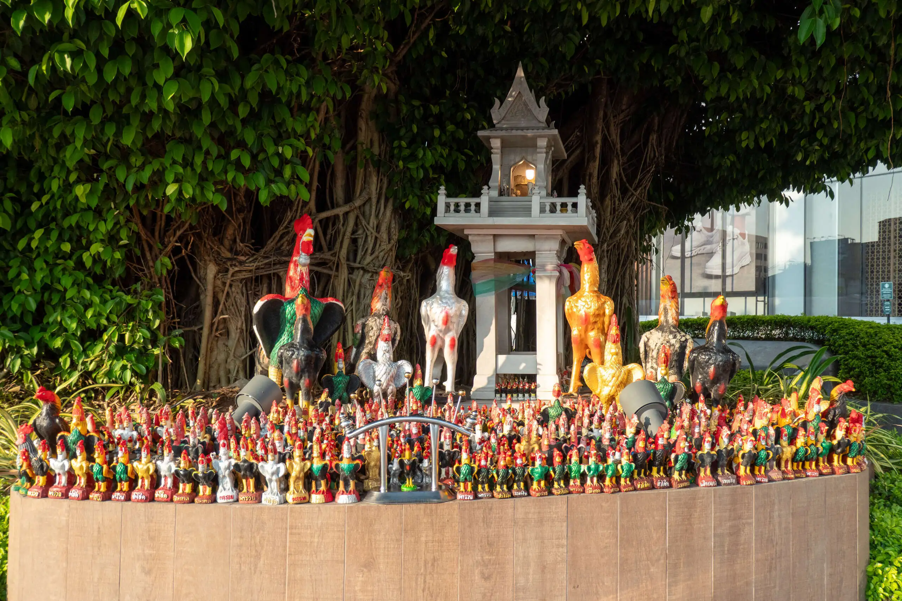

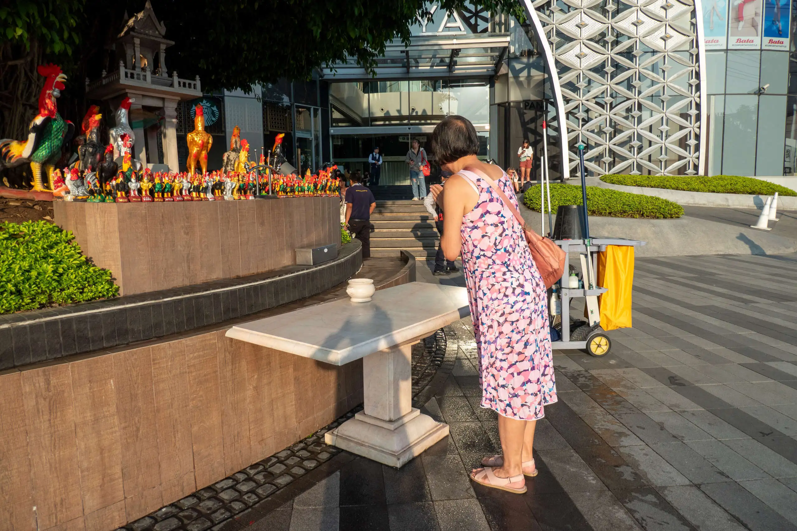

Opposite Maya on Huay Kaew Rd is trendy Think Park, which is a shopping and cafe space.

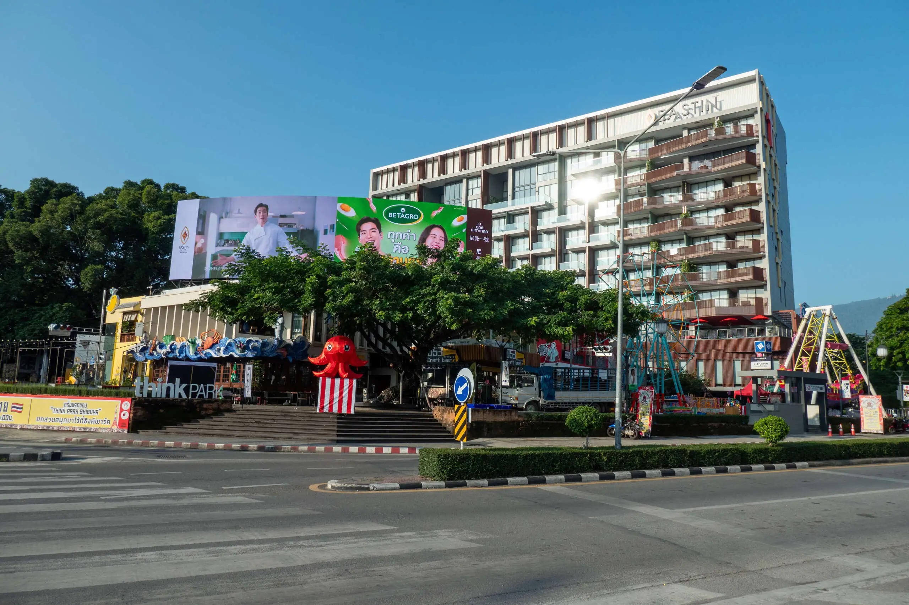

We then walked west along Huay Kaew Rd and passed this golden arch:

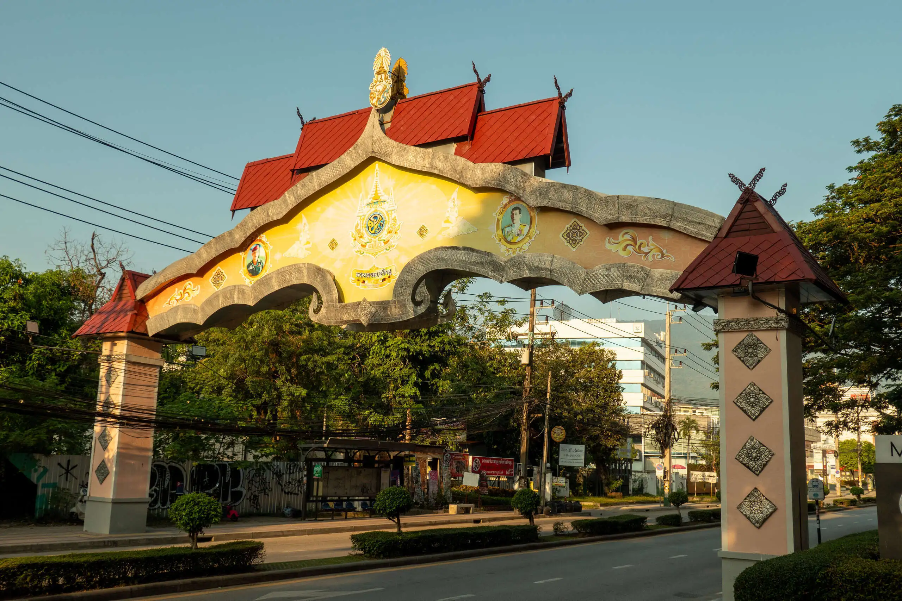

Beyond this is a trendy cafe called [Tiger TED Cafe](https://www.facebook.com/profile.php/?id=100055000754567). We explored here and Cat ordered a juice drink.

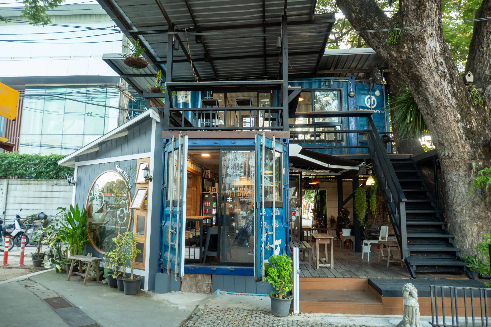

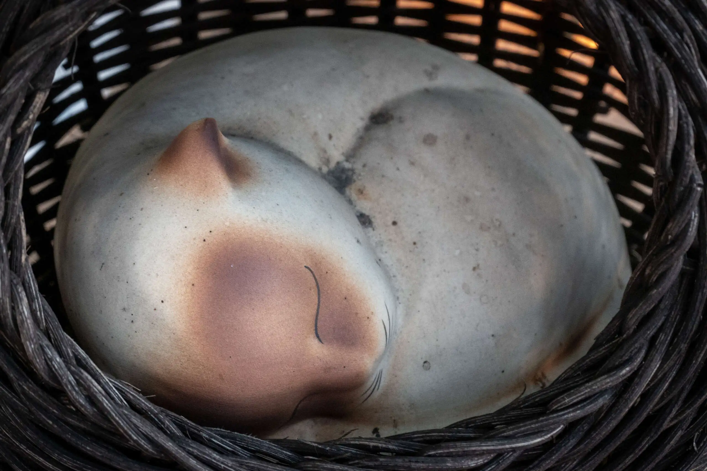

After the cafe is the Kat Rin Kam night market and food centre.

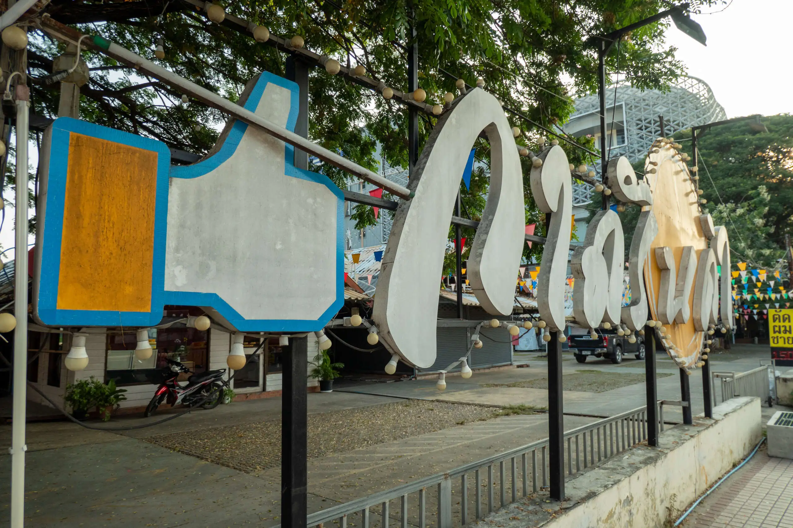

Wandering back to the house via Soi Muban Lanna Villa Rd, we stopped by at Furama Hotel, a local landmark and owned by relatives of one of Cat's friends.

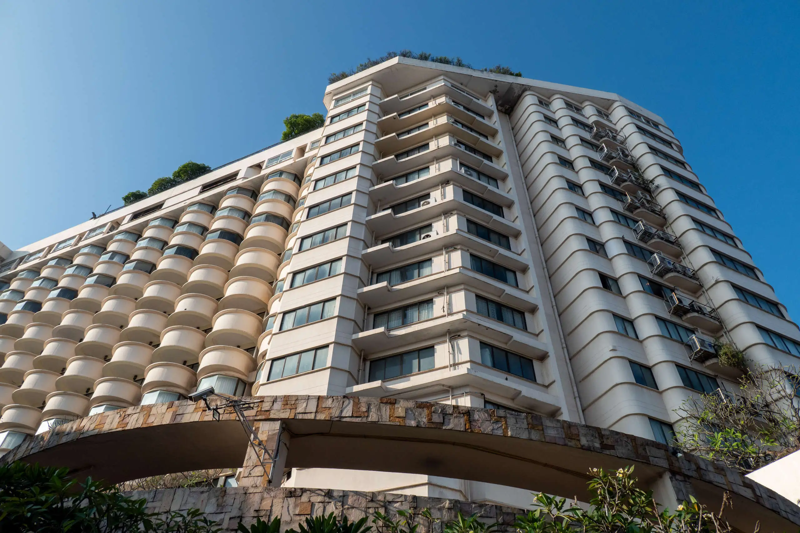

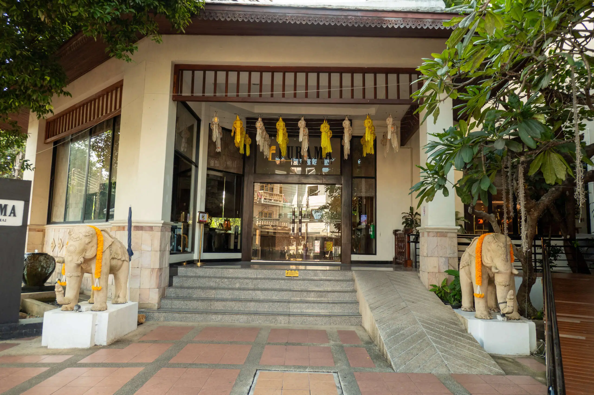

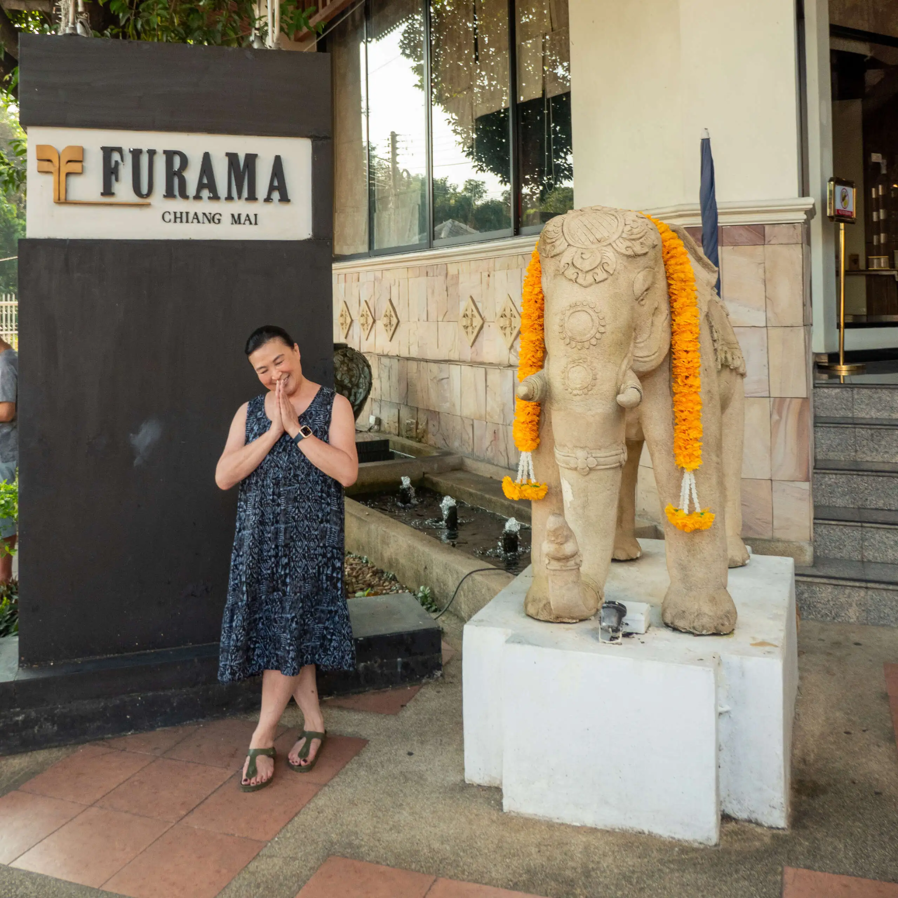
