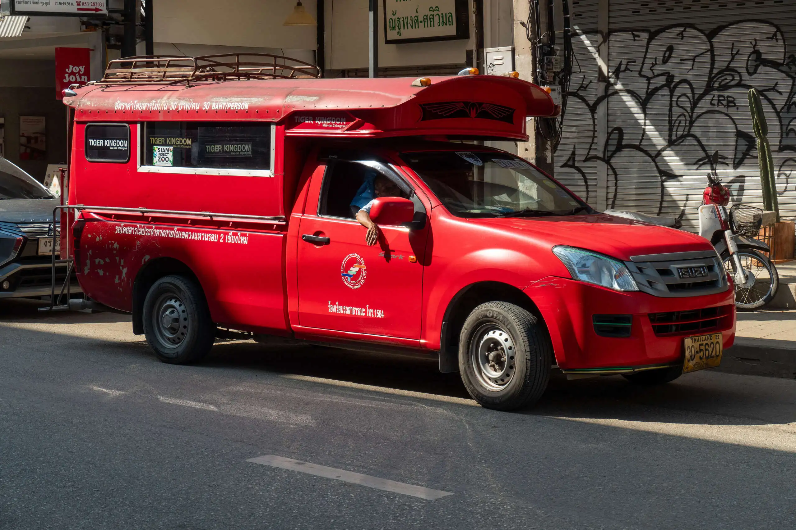
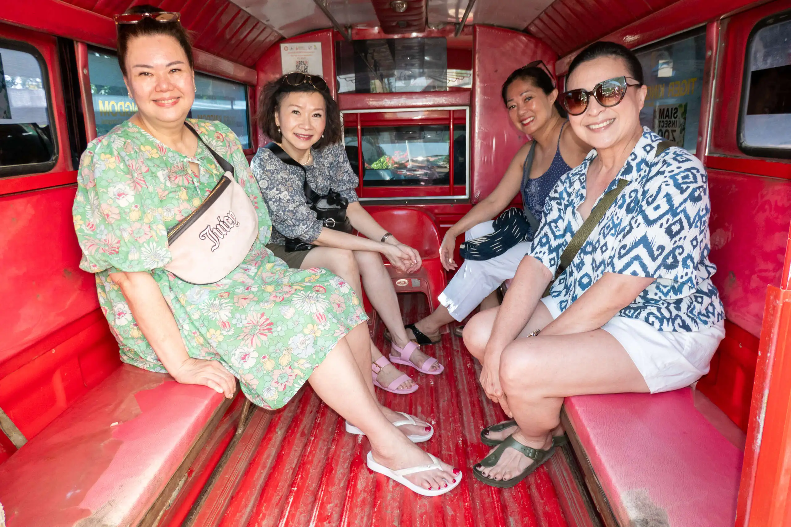
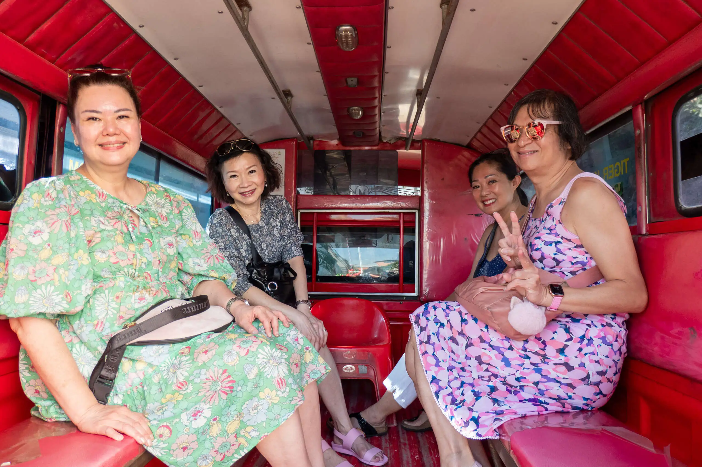
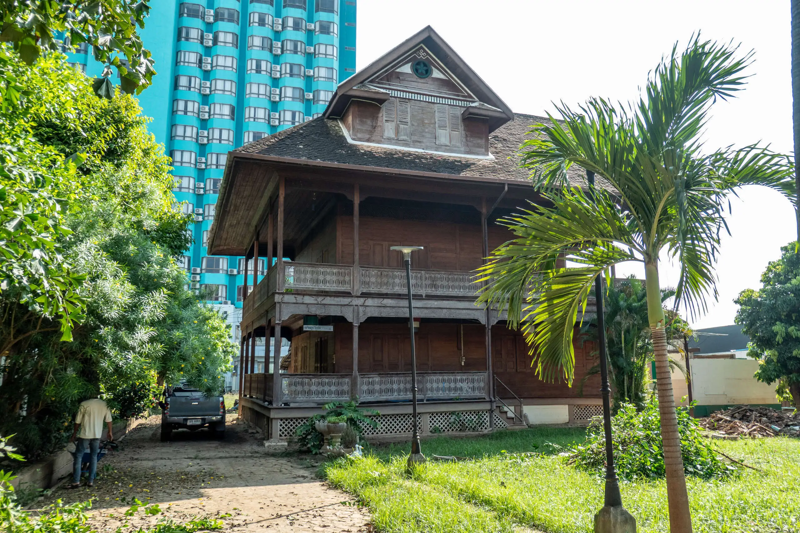
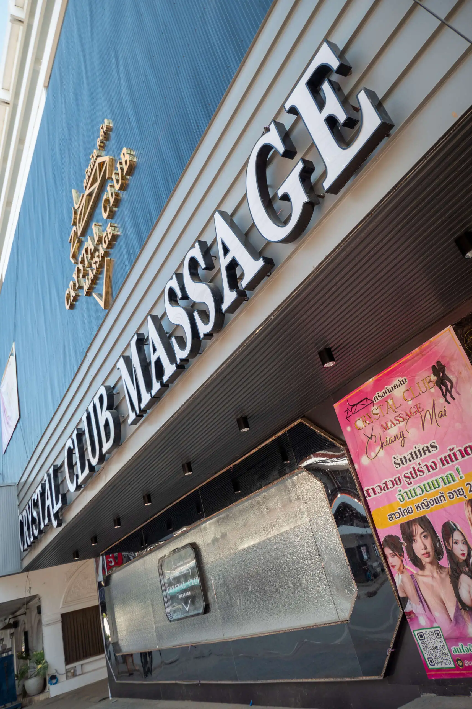
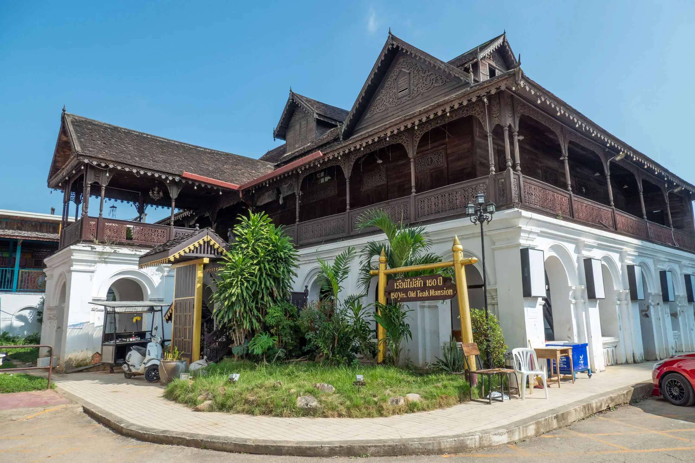
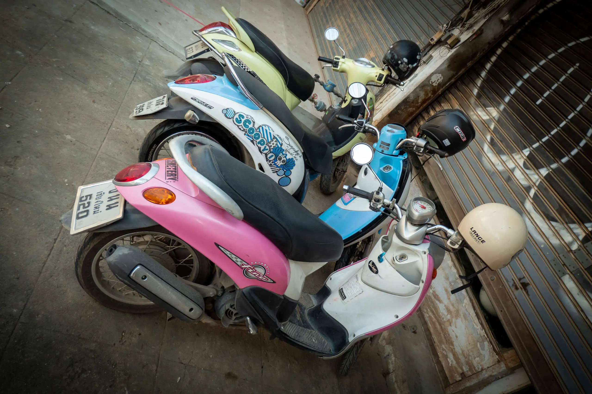
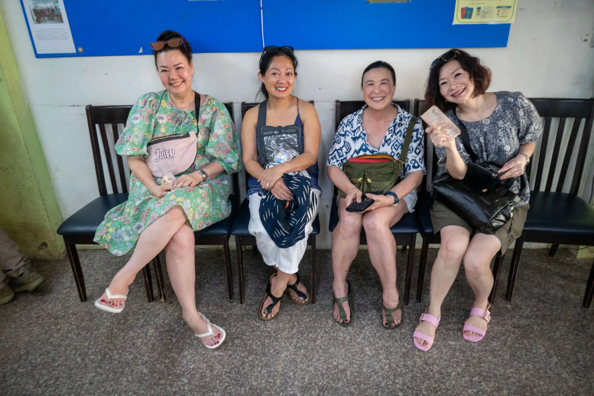

When we returned from our walk, we waited until the other ladies woke up, and then we had breakfast, dressed and went out to visit [S.K. Sakol Money Exchange](https://www.chiangmailocator.com/chiang-mai-banks-currency-exchange-offices-1664:sk-sakol-money-exchange), a foreign currency exchange office located on Charoen Prathet Rd.

We were planning to hire a Grab car to take us there, but we found a Songthaew driver right outside Furama Hotel. He was much cheaper. A songthaew (สองแถว, lit. 'two rows') is a passenger vehicle in Thailand adapted from a pick-up or a larger truck and used as a share taxi or bus. Songthaew rides in Chiang Mai are priced at 30 baht per person per ride (around A$1.50).

We were not aware that we arrived at our destination when the driver stopped (we thought he was just waiting at the traffic lights). The driver got off the car, went to the back, and gave us a "Why aren't you getting off?" shrug.

Lyn had already exchanged my money into Thai baht before I left Australia, so I did not need to visit the money exchange office, so I took the opportunity to wander along the street.

Charoen Prathet Road (ถนนเจริญประเทศ) in Chiang Mai is a well-known street that runs along the eastern side of the Ping River, just outside the Old City walls. This road is a vibrant area that blends Chiang Mai's rich history with modern-day attractions. Many old colonial-style buildings and traditional teakwood houses can still be found along the road, reflecting its historical charm. I found a combination of massage parlours, hotels and old teak mansions.

When the ladies have concluded their money changing transactions, we were ready to head to [Central Festival](https://www.central.co.th/en/store/central-festival-chiangmai) for food and shopping!

