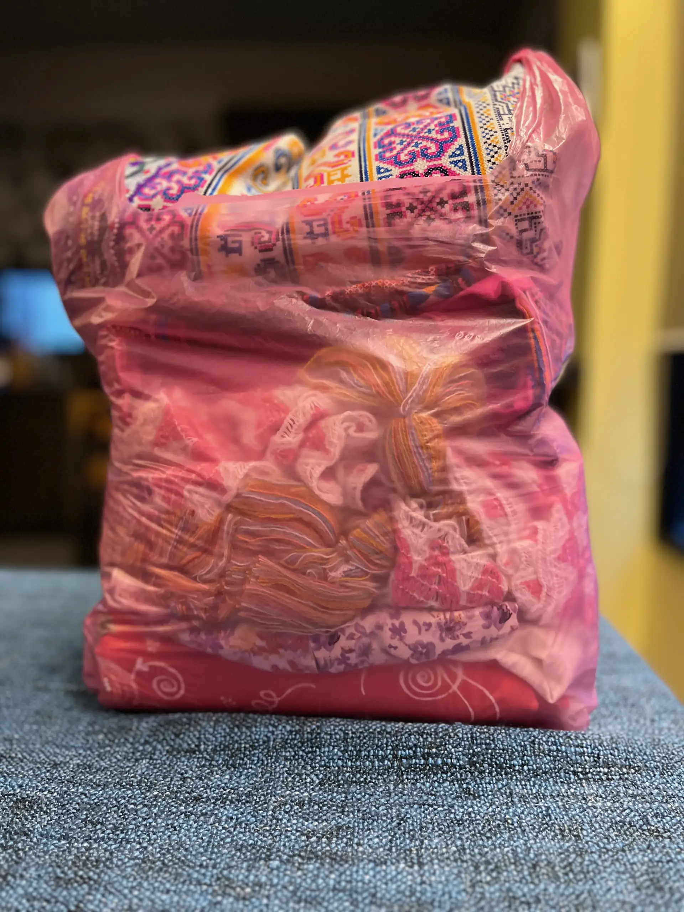

Our first stop on the private tour is [Thaweesin Hot Spring น้ำพุร้อนแม่ขะจาน(ตลาดทวีสิน)](https://www.thailandtourismdirectory.go.th/en/attraction/81747), supposedly the highest and most beautiful hot springs in the north of Thailand. Visitors can soak their feet in the bank of the spring for free, and buy various eggs to cook in the shallow pools.

However, we were much more interested in shopping than soaking our feet in smelly sulphuric water or boiling eggs. We were attracted by the shops selling various Northern Thai costumes. All of us ended up buying various items here. I bought a traditional dress, a Thai belt and a skort but some of the other ladies bought even more items.

The vendor told us his prices were cheaper than in Chiang Rai, and this is partially true. Prices at the various tourist locations in town were a little bit more expensive, but they were higher quality.

I did end up doing a quick tour around the place and it was quaint but has obviously seen better times. It's basically just a garden around the hot springs surrounded by shops, with some unfinished constructions at the back. Patter, our tour guide, took pity on us and took a few pictures of us standing next to the hot geyser.

I think we ended up spending over an hour here at what was supposed to be a quick 30 minute comfort stop. After that Patter realised his carefully constructed dense itinerary is in serious jeopardy, so he did some quick improvisation and suggested our next stop should be lunch along the way rather than heading straight to White Temple. We heartily agreed, because breakfast now seemed a long time ago.

To give you an idea how much we bought here, this is my shopping bag:

