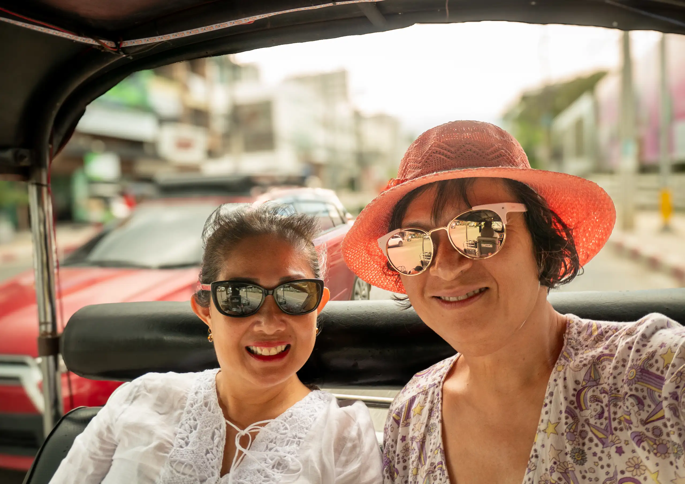

This is our last day in Chiang Mai. We opted for a tuk tuk tour of the old city:

The tuk tuk took Margaret and I around the perimeter of the old city and we can see the remains of the old city walls and moat.

Chiang Mai ("new city") was founded in 1296 CE (1839 BE) by King Mangrai (Phaya Mangrai), who was the premier ruler of the Lanna Kingdom. The city was intended to replace Chiang Rai as the capital of the Lanna Kingdom. The city was established in an area that was formerly part of the Hariphunchai Kingdom (in present-day Lamphun Province) next to the Ping River. King Mangrai built the city as the political, commercial, and cultural center of Lanna.

Chiang Mai was designed with a well-planned layout, which featured city walls and a moat surrounding the city for the purpose of slowing down invasion as well as a security structure for those going in and out of the city. There are currently five main gates in the city wall that attest to the glorious past: Tha Phae Gate, Suan Dok Gate, Chang Phuak Gate, Chiang Mai Gate, and Saen Phu Gate. The early construction of Chiang Mai emphasized the building of important temples and religious sites, thus making the city a religious and cultural hub.

According to this [interesting article](http://www.bytelife.altervista.org/thapae.htm) the ancient walls and gates of the old city were deliberately taken down prior to World War II and used for road construction, so it wasn't destroyed during World War II as I had originally thought. The Tha Pae gate where many tourists take photographs is actually a reconstruction from 1986. This is another interesting [article](https://changpuakmagazine.com/en-article/WALLS-AND-GATES/300287/) that talks about the walls and gates of Chiange Mai.

Our first stop in the tuk tuk tour is [Wat Chiang Man](https://en.wikipedia.org/wiki/Wat_Chiang_Man) (วัดเชียงมั่น). The oldest structure here is the Chedi Chang Lom ('Elephant Chedi') fronted by two large viharns. The smaller viharn contains a crystal Buddha called Phra Sae Tang Khamani. I was intrigued by the many murals on the walls depicting various Buddhist scenes.

The main viharn contains multiple golden statues of Buddhas on a mondop structure. The historic chedi is very impressive - the square base supports a second level which has the front half of 15 life-sized brick-and-stucco elephants emerging from it. The elephants seem to carry the upper levels of the building on their backs. The gilded upper part of the chedi contains a bell shaped relic chamber directly underneath the pinnacle.

At the back of the temple is the Ho Trai (Temple Library) set on an artificial island in the middle of a lotus pond. We were allowed to pose for photographs on the bridge to the library, but not allowed to enter the library itself.

There is also an ubosot here which we did not enter.
