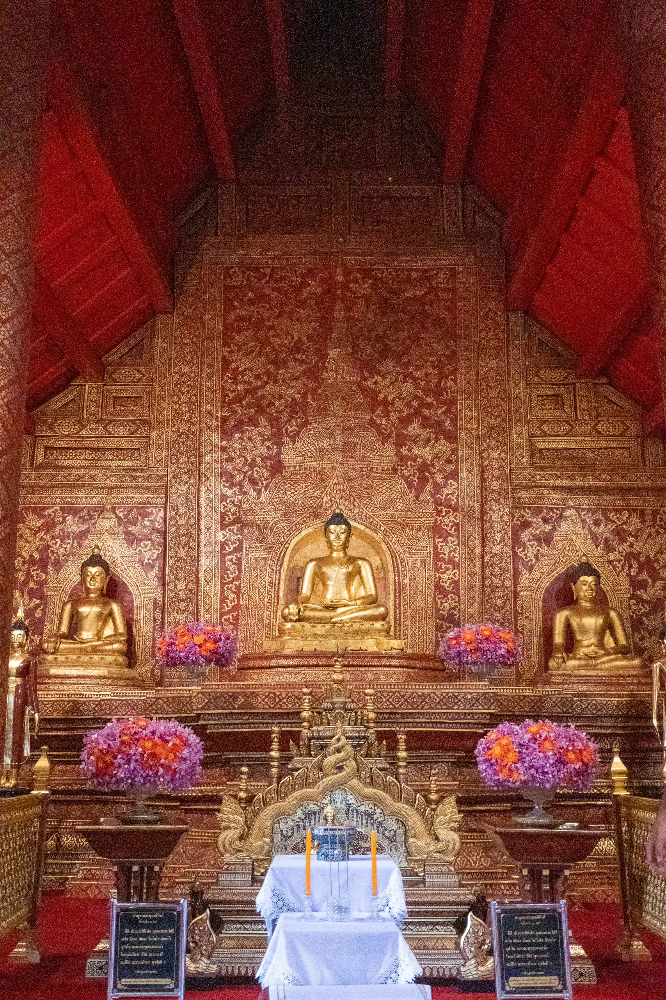
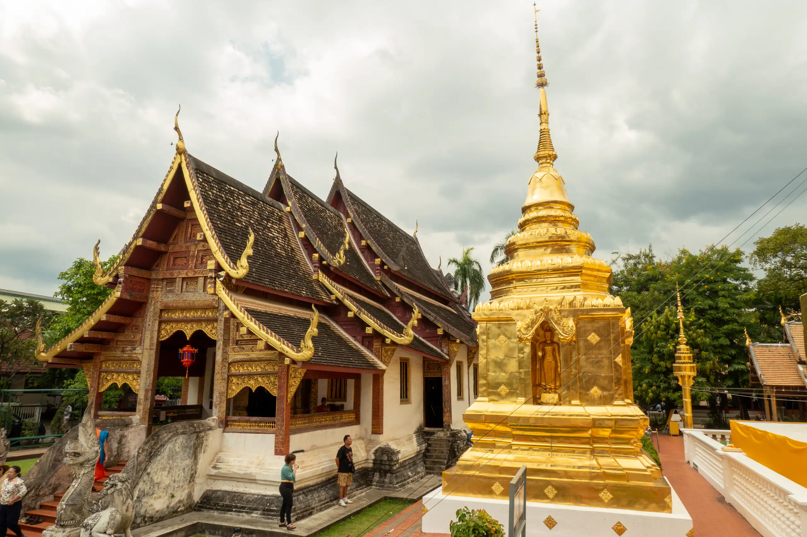
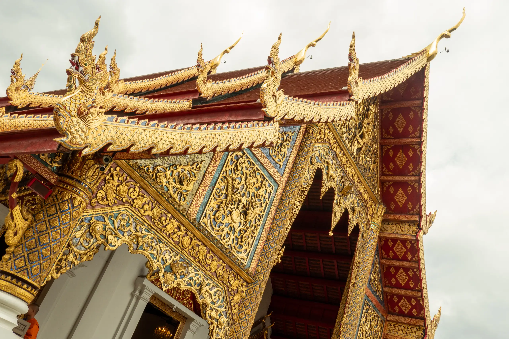
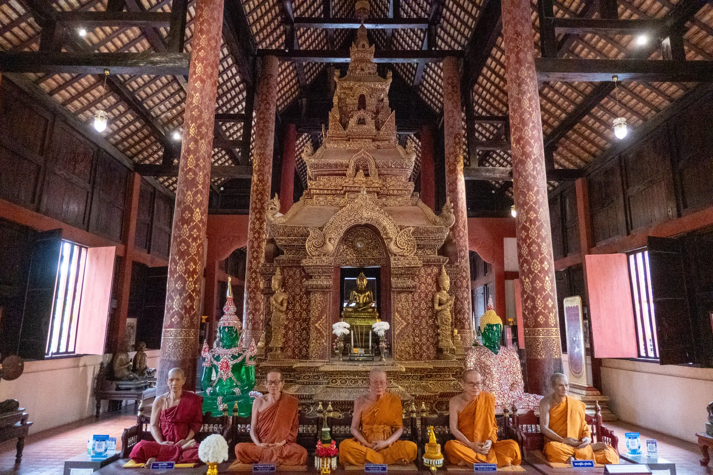
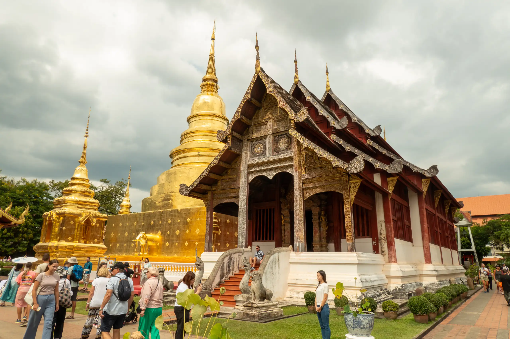
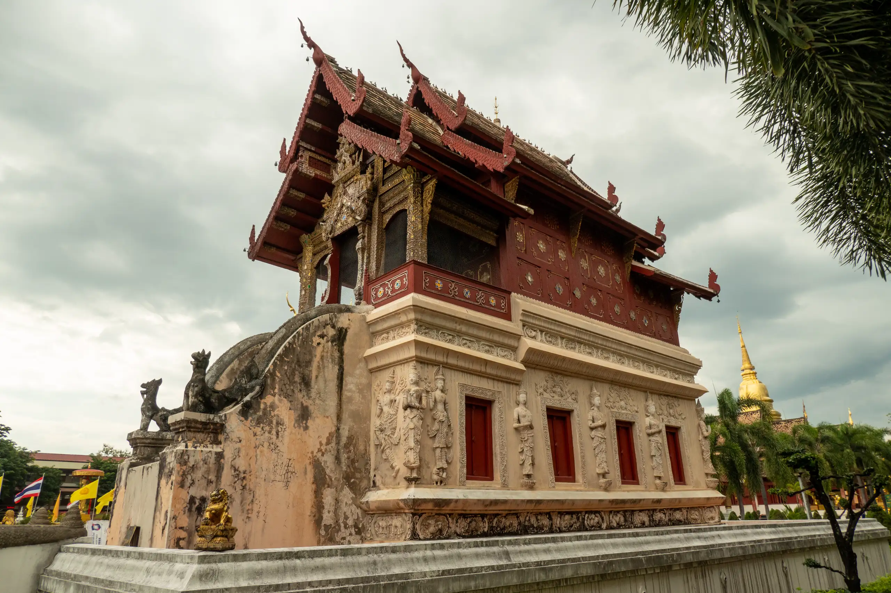
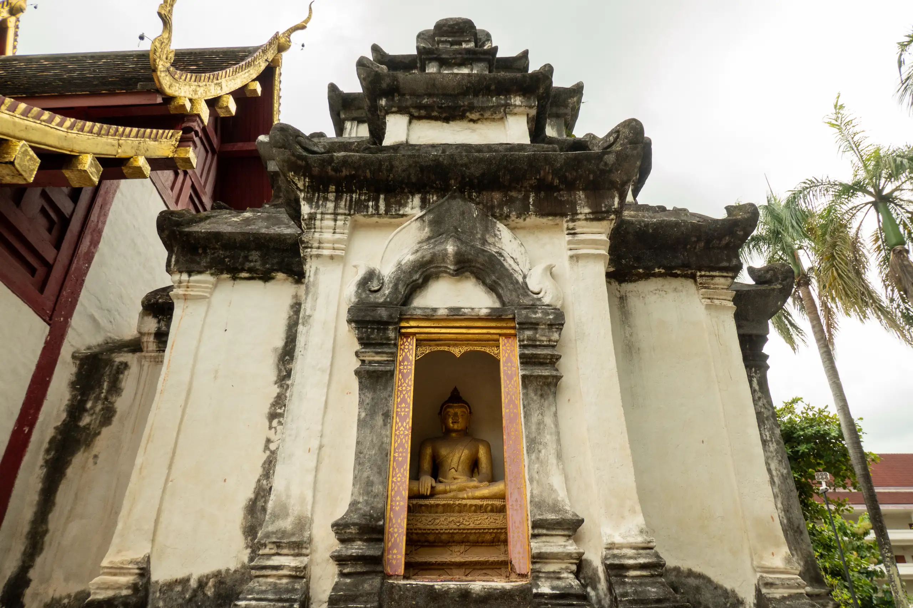

Some people say [Wat Phra Singh Woramahaviharn](https://en.wikipedia.org/wiki/Wat_Phra_Singh) (วัดพระสิงห์วรมหาวิหาร) is the most beautiful temple in Chiang Mai. It is also known as the “Monastery of the Lion Buddha’ or the ‘Temple of the Lion Buddha’

The striking feature in this temple, and the oldest structure, is the main chedi, that was built in 1345 by King Pha Yu to enshrine the ashes of his father. The chedi (Chedi Than Chang Lom Wat Phra Singh - เจดีย์ฐานช้างล้อมวัดพระสิงห์) is circular in shape with a square base. Each of the sides of the chedi is decorated with elephant figures emerging from the chedi. Since its construction in the 14th century it has been enlarged considerably.

The main viharn (Viharn Lai Kham) or assembly hall was built at the end of the 14th century using Lanna style architecture to house a very highly revered Buddha image named Phra Singh Buddha.

The very ornate exterior of the Viharn Lai Kham is decorated in typical Lanna gold and ochre colors. The viharn made from teak wood has a three tiered roof line, the lower edges of which are decorated with chofahs, a ornamental decoration that resembles the shape of a very thin bird.

The largest building at Wat Phra Singh is its other prayer hall, Viharn Luang, which was built in 1925 as replacement for the original dilapidated prayer hall built in the 14th Century. The front of this massive structure is very ornately decorated in gold relief.

Inside the Viharn Luang there is a 15th Century Buddha statue, the Phra Chao Thong Tip. The origins of this statue are known. It was cast in 1477 in Chiang Mai. Around the statue are life sized models of important monks who lived at the temple which are so life like that at a glance visitors are likely to mistake them for real live monks.

The ubosot or ordination hall is an ornate teak wood structure built in 1806.

There are several other buildings here, including the Ho Tai scripture library (หอไตร)

An example is the Chedi Ku Lai, which has a five-tiered roof and its inner chamber is connected by an “overground tunnel” to the viharn.

Other buildings here include monks' living quarters, various statues in gardens etc.
