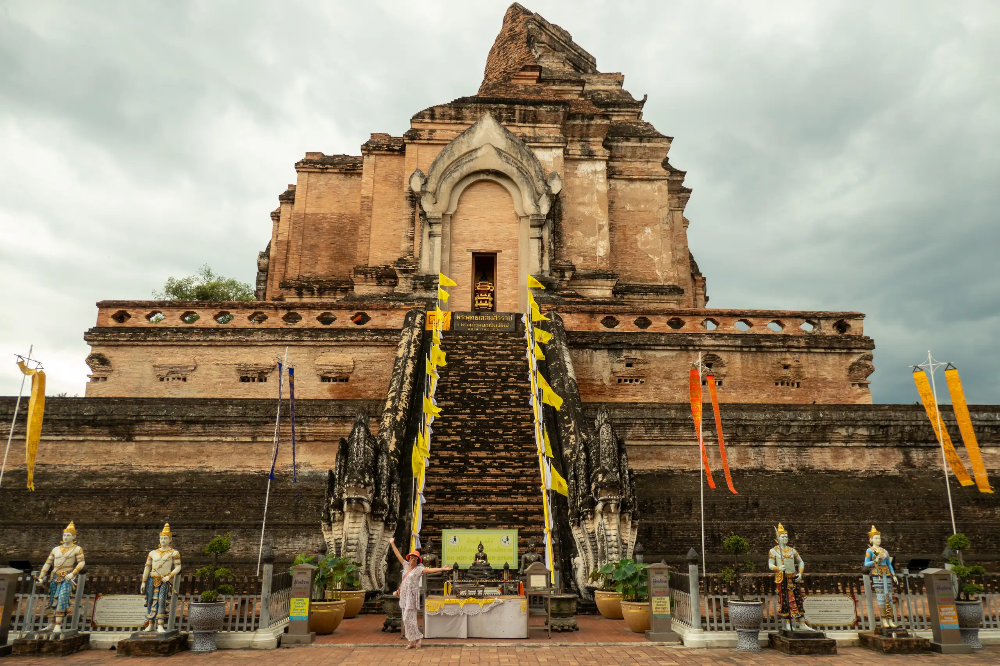
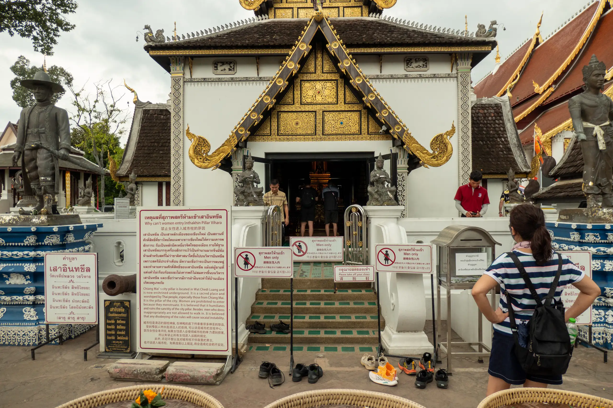
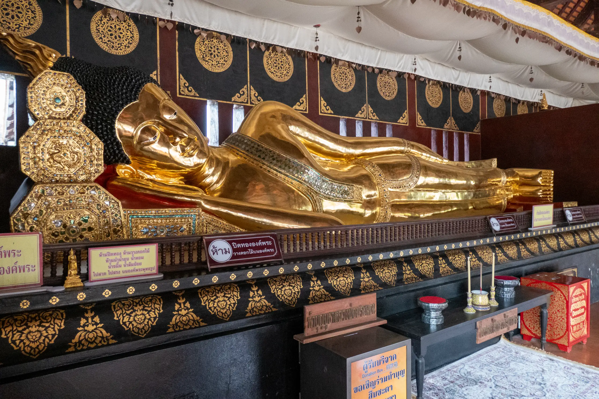
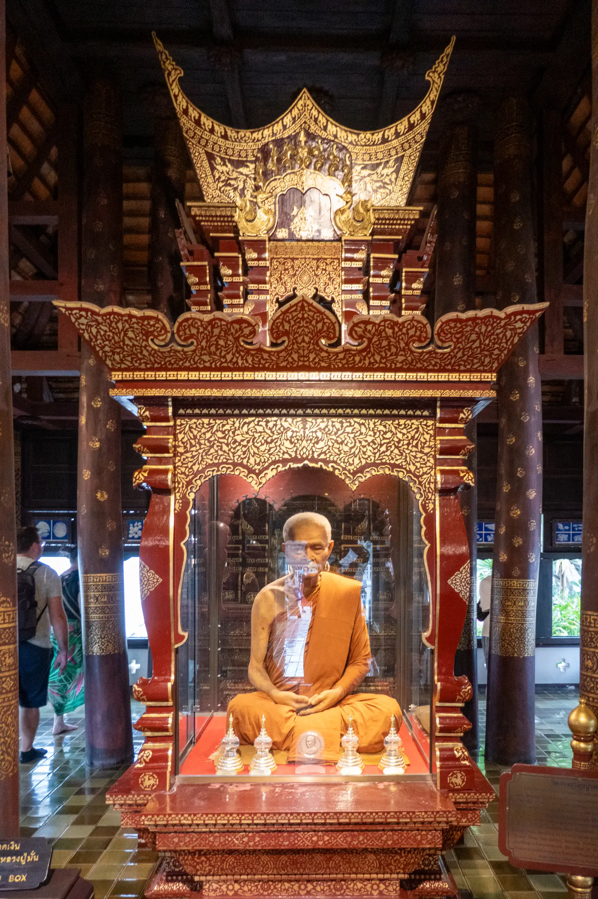

[Wat Chedi Luang](https://en.wikipedia.org/wiki/Wat_Chedi_Luang) (Thai: วัดเจดีย์หลวง) lives up to it's name, for the chedi is truly massive.

The construction of the temple started in the 14th century, when King Saen Muang Ma planned to bury the ashes of his father in the place. After 10 years of building time it was left unfinished, later to be continued after the death of the king by his widow. Probably due to stability problems it took until the mid-15th century to be finished during the reign of king Tilokaraj. It was then 82 m high and had a base diameter of 54 m, at that time the largest building of all Lanna. In 1468, the Emerald Buddha was installed in the eastern niche. In 1545, the upper 30 m of the structure collapsed after an earthquake, and shortly thereafter, in 1551, the Emerald Buddha was moved to Luang Prabang.

In the early 1990s the chedi was reconstructed, financed by UNESCO and the Japanese government.

Also on the temple grounds is the city pillar (Lak Mueang) of Chiang Mai, named Sao Inthakin. Only men are allowed to go inside the shrine, so we could only view it from the outside.

There is a pavilion here housing a reclining Buddha.

The there is also another pavilion housing a wax figure of Chan Kusalo.

After that the tuk tuk driver dropped us back at MAYA where we had lunch before doing some shopping.
