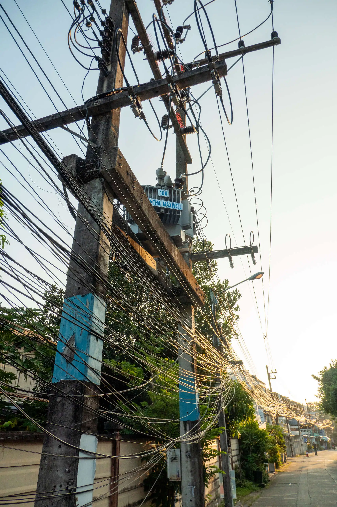
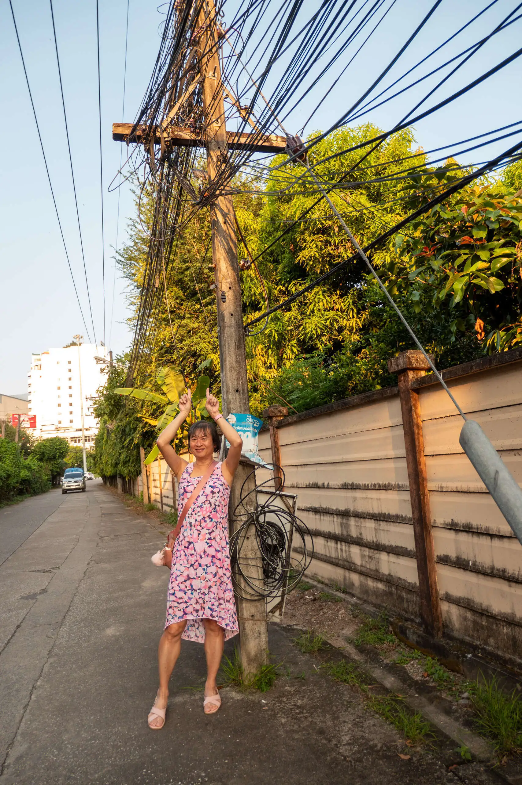
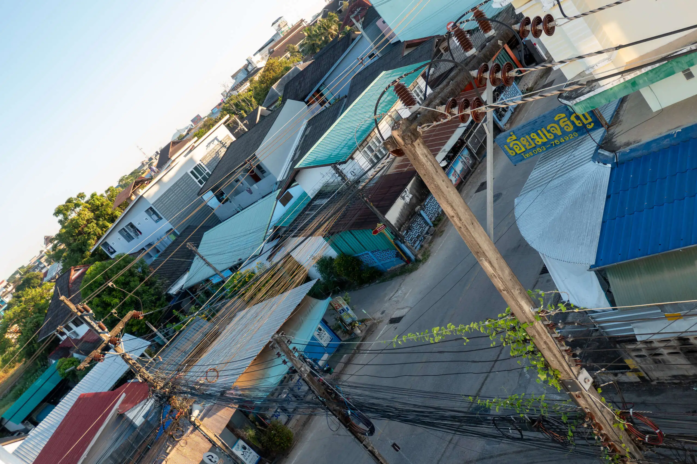
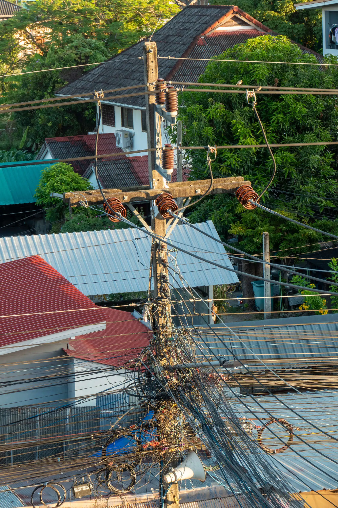

Here are some examples of cabling on poles in Thailand.

I first encountered them on the street from the townhouse we were living in Chiang Mai to the main street.

These examples are from the balcony of the property we stayed in Chiang Rai.

Finally, here are some examples from Nimman:

